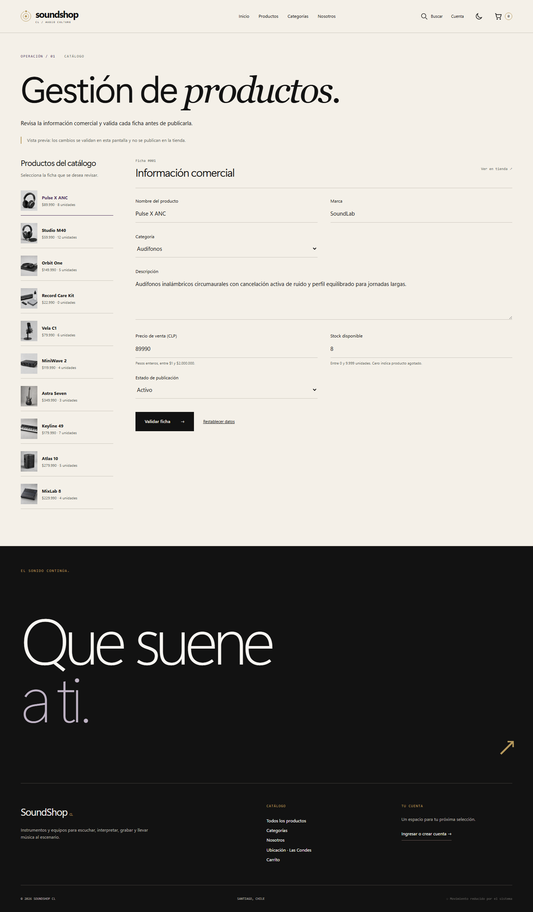
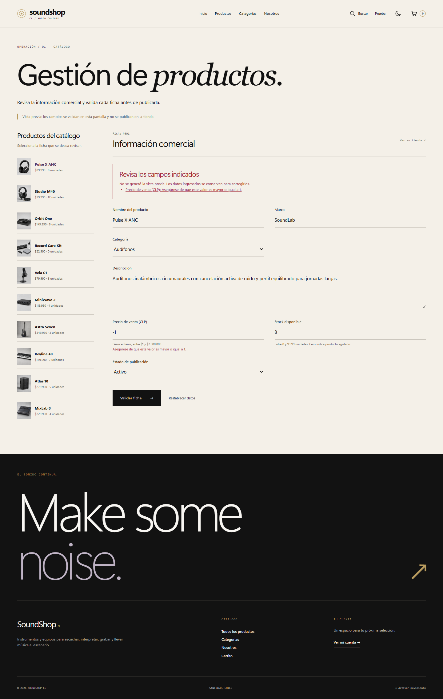
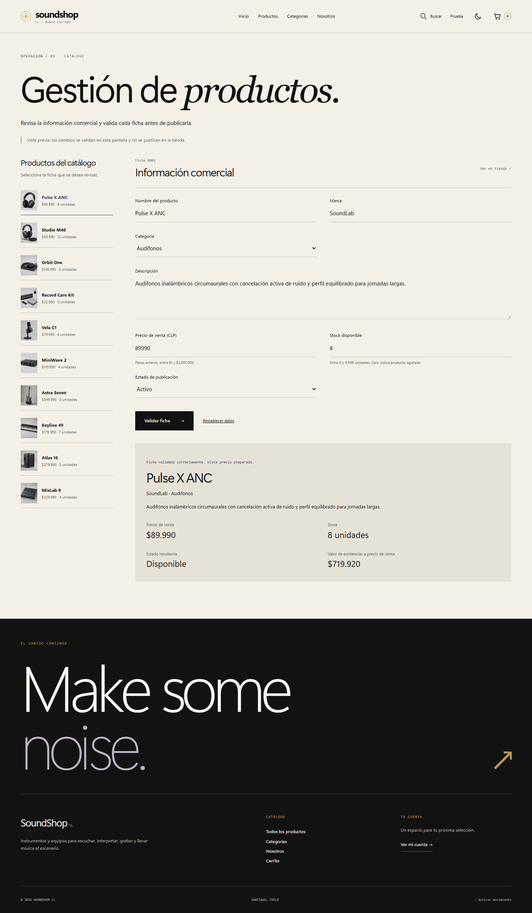

# Indicador 2: entradas, salidas y validaciones

El indicador exige determinar las operaciones de entrada/salida y las validaciones necesarias para procesar los formularios administrativos del caso. La vista `/gestion/productos/` aporta una ficha comercial de producto que permite demostrar esa lógica con datos del catálogo JSON. La ficha puede cargarse, corregirse, validarse y restablecerse. El resultado se genera en el servidor y se presenta en HTML mediante Django Templates.

## Reglas de la ficha administrativa

| Entrada | Tipo y validación del servidor | Resultado o error |
|---|---|---|
| Identificador de ficha | Entero y producto existente | Carga datos del JSON; un ID desconocido vuelve al listado con aviso |
| Nombre | Texto normalizado, entre 3 y 100 caracteres | Nombre de la vista previa o error junto al campo |
| Marca | Texto normalizado, entre 2 y 60 caracteres | Marca de la vista previa o error junto al campo |
| Categoría | Una de las cinco categorías del catálogo | Nombre de categoría resuelto desde el servidor; rechaza valores manipulados |
| Descripción | Texto normalizado, entre 20 y 600 caracteres | Descripción escapada al mostrarla en HTML |
| Precio | Entero entre 1 y 2.000.000 pesos | Precio formateado en CLP; rechaza cero, negativos, fracciones y texto |
| Stock | Entero entre 0 y 9.999 | Unidades disponibles; rechaza negativos, fracciones y texto |
| Estado | Activo o inactivo | Inactivo prevalece sobre el stock; activo con cero unidades resulta agotado |
| Envío | POST y token CSRF | Valida todos los campos; sin CSRF se rechaza la solicitud |

Si existen errores, la respuesta conserva las entradas, muestra un resumen con enlaces a los campos y no produce una ficha validada. Si todos los datos son válidos, presenta nombre, marca, categoría, descripción, precio, stock y disponibilidad. Calcula `valor de existencias = precio de venta × stock`; este valor no se presenta como costo contable ni como una venta realizada.

## Recorrido de demostración

1. Abrir `/gestion/productos/` y seleccionar Pulse X ANC.
2. Introducir un precio negativo y validar: se conserva el resto del formulario y se identifica el error.
3. Corregir el precio a 100000 y el stock a 3: la salida muestra $300.000 de existencias a precio de venta.
4. Introducir stock 0 y estado activo: la salida muestra Agotado.
5. Elegir estado inactivo: la salida muestra Inactivo, incluso si hay unidades.
6. Restablecer: la ficha recupera los datos originales del JSON.

## Alcance de Evaluación 1

Esta es una vista administrativa inicial para validar fichas y previsualizar resultados. No publica cambios ni escribe el catálogo, las cuentas, el carrito o una base de datos. Su acceso es público porque no realiza cambios administrativos reales; no representa control de roles. La administración persistente y sus permisos quedan fuera de esta funcionalidad. La navegación comercial sigue en las rutas habituales de la tienda; el panel se abre mediante su dirección y los enlaces de esta documentación.

La lógica está en `core/forms.py` (`FichaGestionForm`) y `core/gestion.py`; la salida se renderiza en `templates/core/gestion_producto.html`. Las pruebas de `core/test_gestion.py` comprueban reglas, cálculos, estados, datos inválidos, conservación del JSON, CSRF y escape HTML. Esta evidencia respalda el indicador 2; la calificación definitiva corresponde al docente.

## Evidencia de verificación

La revisión del 6 de septiembre de 2026 completó 50 pruebas de Django correctamente, incluidas las seis pruebas del módulo de gestión. Una revisión anterior de navegador comprobó 390 y 1440 píxeles con los temas claro y oscuro: cuatro combinaciones sin desbordamiento de página ni errores de JavaScript. Se verificaron el envío incorrecto, la corrección, el cálculo y el restablecimiento. Un recorrido adicional sin JavaScript comprobó la salida Agotado con stock cero.

