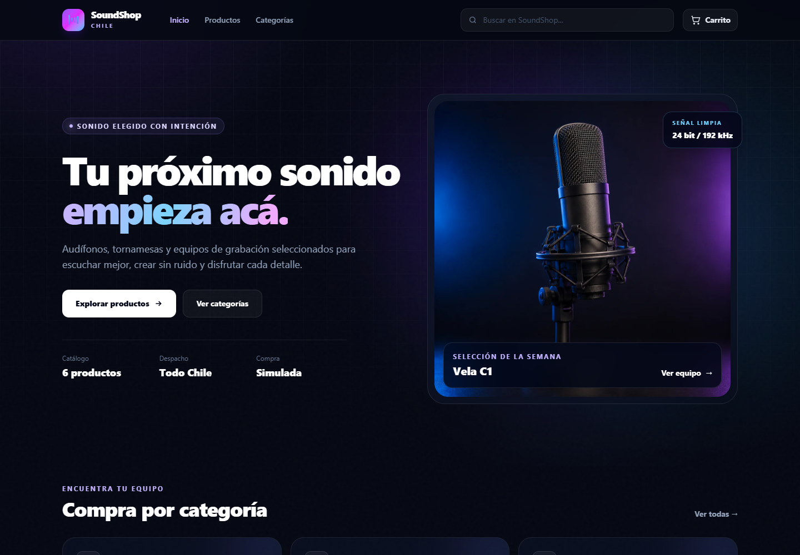
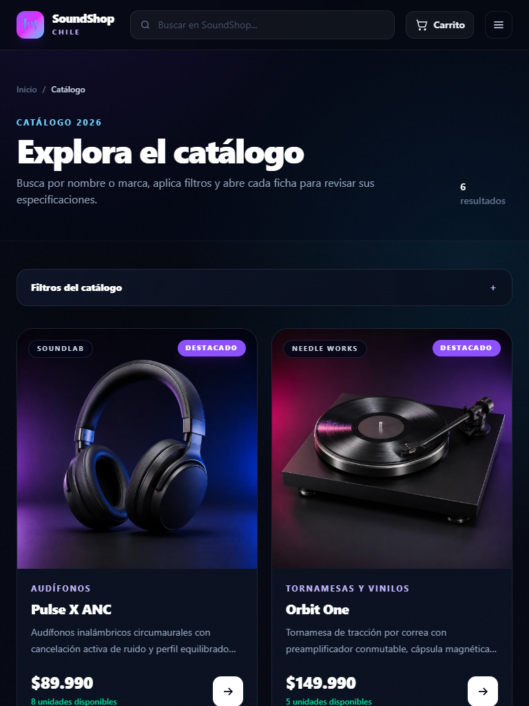
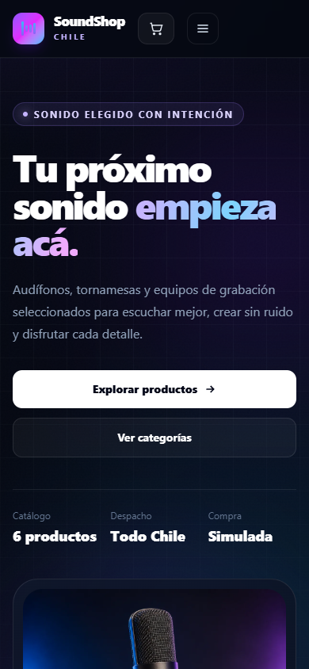
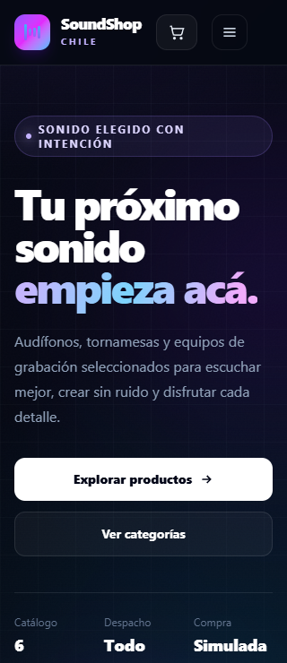
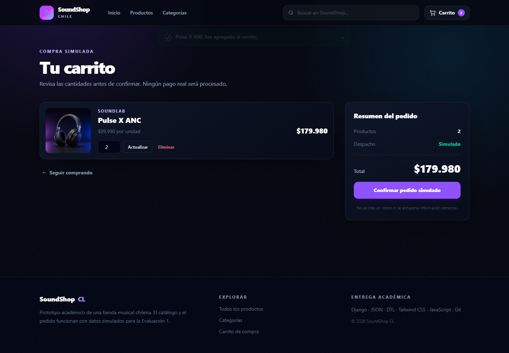
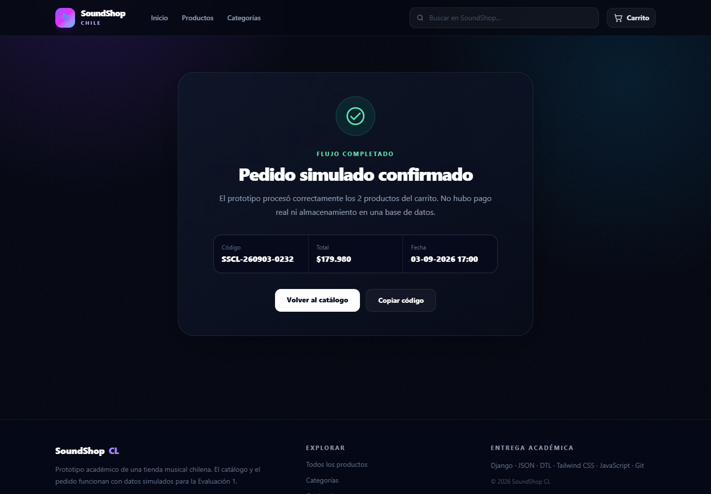

# 6. Mockups y evidencia del prototipo de interfaz

## 6.1 Criterio de presentación

Los mockups corresponden a capturas del prototipo navegable, no a pantallas dibujadas sin implementación. Cada imagen proviene de la misma aplicación Django entregada en el repositorio y muestra el HTML semántico procesado con plantillas DTL y Tailwind CSS. Esta evidencia permite comparar las principales vistas con la navegación definida en el diagrama de flujo.

## 6.2 Portada en escritorio

La vista de 1440 × 1000 píxeles presenta la identidad SoundShop CL, navegación principal, buscador, acceso al carrito, propuesta de la tienda, categorías y producto destacado.

## 6.3 Catálogo en tableta

La vista de 768 × 1024 píxeles reorganiza la navegación, convierte los filtros en un panel desplegable y mantiene dos columnas de productos. Las tarjetas muestran marca, categoría, precio, stock y acceso a la ficha.

## 6.4 Portada en teléfono

La captura de 390 × 844 píxeles conserva la misma información y reemplaza la navegación de escritorio por un botón de menú. Los botones ocupan el ancho disponible y el contenido no genera desplazamiento horizontal.

La anchura mínima comprobada fue 320 píxeles. El encabezado, el texto, los botones y las estadísticas se mantienen dentro del área visible.

## 6.5 Carrito y salida del proceso

El carrito representa la operación principal de entrada y cálculo. La vista muestra dos unidades, su subtotal, controles de actualización y el total del pedido. El servidor valida la cantidad antes de aceptar cualquier cambio.

La última pantalla confirma que el flujo terminó y entrega código, total y fecha. El texto declara que el proceso es simulado y que no utiliza pago ni base de datos.

## 6.6 Comprobación responsive

| Vista | Ancho | Código HTTP | Desbordamiento horizontal | Error de JavaScript o consola |
|---|---:|---:|---|---|
| Portada escritorio | 1440 px | 200 | No | No |
| Catálogo tableta | 768 px | 200 | No | No |
| Portada teléfono | 390 px | 200 | No | No |
| Portada mínima | 320 px | 200 | No | No |

El flujo automatizado abrió la ficha `Pulse X ANC`, agregó dos unidades, verificó el total `$179.980`, confirmó el pedido y buscó `microfono`. La búsqueda devolvió únicamente `Vela C1`, lo que comprueba la normalización de tildes y la representación dinámica del resultado.
