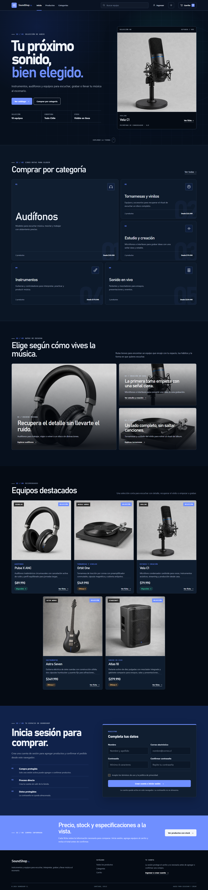
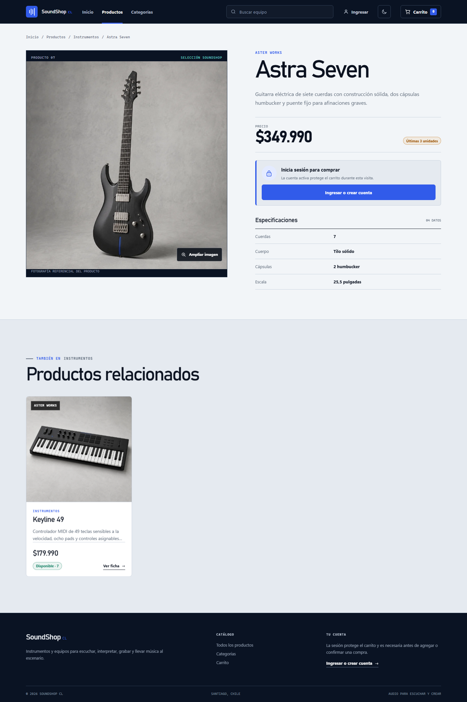
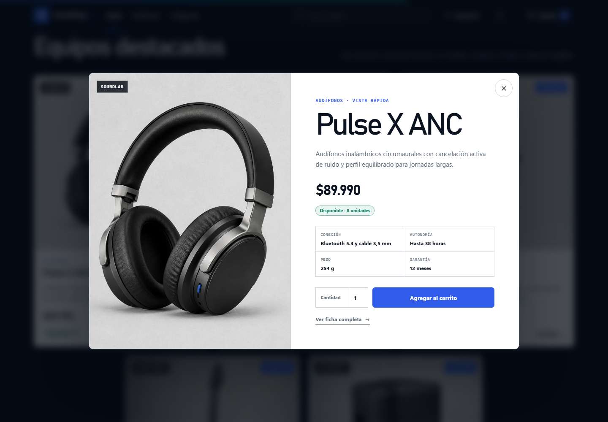
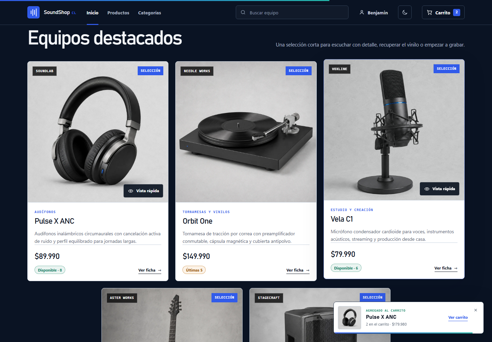
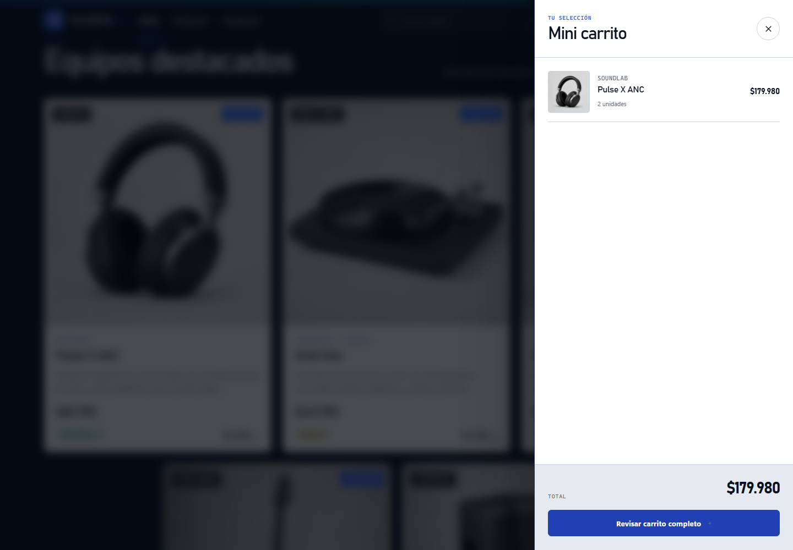
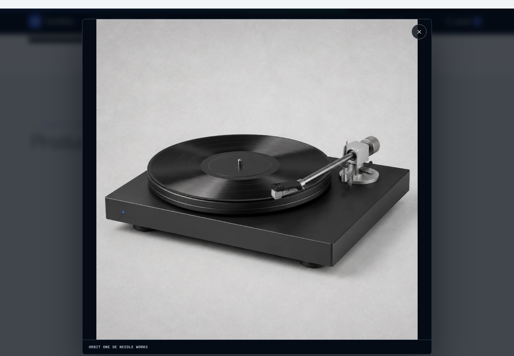
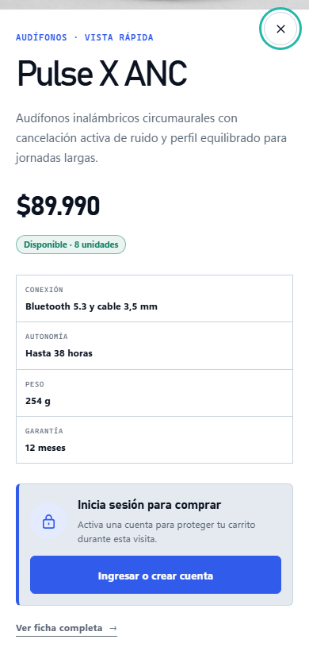
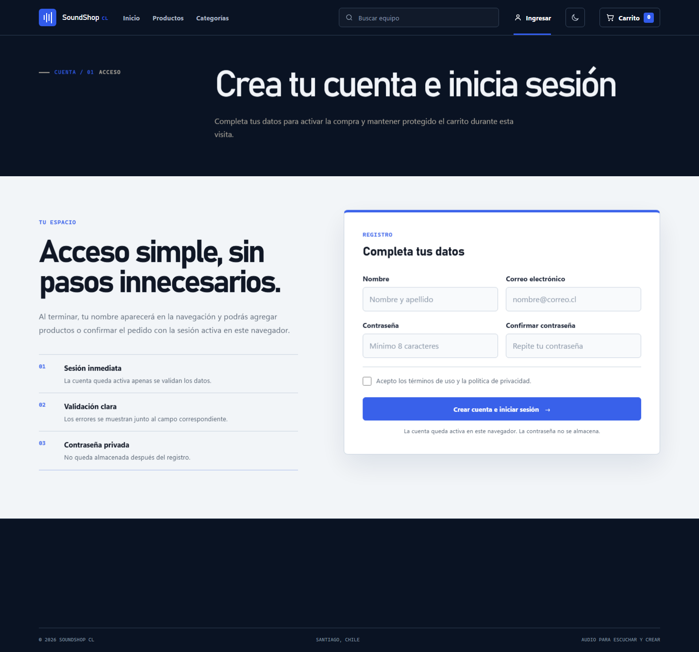

# 6. Mockups y evidencia del prototipo de interfaz

## 6.1 Criterio de presentación

Los mockups corresponden a capturas del prototipo navegable, no a pantallas dibujadas sin implementación. Cada imagen proviene de la misma aplicación Django entregada en el repositorio y muestra el HTML semántico procesado con plantillas DTL y Tailwind CSS. La dirección visual toma referencias de catálogos técnicos de audio: azul noche, cobalto, gris frío, acentos aqua, tipografía Bahnschrift/Aptos y fotografías de estudio con fondo neutro. La portada utiliza un hero de primera pantalla, tipografía XXL y una cuadrícula Bento para las categorías. La interfaz pública no muestra etiquetas de evaluación ni mensajes que la presenten como una maqueta.

## 6.2 Portada en escritorio

La vista de escritorio presenta la identidad SoundShop CL, navegación principal, buscador, selector de tema, acceso de cuenta y carrito. La primera pantalla divide la propuesta de la tienda y el producto seleccionado. El fondo usa una retícula técnica ligera y un indicador invita a recorrer la página. Al continuar aparecen cinco categorías en una cuadrícula Bento, tres composiciones editoriales, los productos destacados y el formulario de acceso.

## 6.3 Portada en modo oscuro

El modo oscuro es una variante nativa de toda la interfaz, no un filtro aplicado a la captura. Cambia superficies, texto, líneas, formularios, tarjetas y controles mediante variables CSS. La selección queda guardada en `localStorage` y se conserva al recargar o cambiar de ruta.

## 6.4 Vista rápida, confirmación y mini carrito

Cada tarjeta ofrece una vista rápida al pasar el mouse o enfocar el control. El diálogo conserva la fotografía, descripción, precio, stock y especificaciones del producto. Cuando no existe una sesión, reemplaza la cantidad por un acceso claro y no altera el carrito.

Con la cuenta activa, el mismo diálogo habilita la cantidad. El formulario se envía con `POST` y CSRF a la misma vista Django utilizada por la ficha completa.

El agregado válido no cambia de ruta. Una confirmación breve informa el producto y la cantidad; el mini carrito lateral muestra inmediatamente la línea, el subtotal y el total. Desde ese panel se abre el carrito completo para editar o confirmar.

La ficha detallada permite ampliar la fotografía sin perder la página ni las especificaciones del producto.

## 6.5 Catálogo en tableta

La vista de 768 × 1024 píxeles reorganiza la navegación, convierte los filtros en un panel desplegable y mantiene dos columnas de productos. Las tarjetas muestran marca, categoría, precio, stock y acceso a la ficha.

## 6.6 Portada y vista rápida en teléfono

El navegador se configuró con un viewport nominal de 390 × 844 píxeles. La captura conserva la misma información y reemplaza la navegación de escritorio por un botón de menú. Los botones ocupan el ancho disponible y el contenido no genera desplazamiento horizontal.

La vista rápida se convierte en un panel vertical desplazable. El control de cierre, la fotografía, el stock, las especificaciones y el aviso de sesión conservan el ancho del dispositivo.

La anchura mínima comprobada fue 320 píxeles. El encabezado, el texto, los botones y las estadísticas se mantienen dentro del área visible.

## 6.7 Registro de cuenta

La ruta de acceso organiza los campos en una vista propia y conserva el mismo sistema visual de la tienda. Nombre, correo, contraseña, confirmación y aceptación de condiciones poseen etiquetas visibles y errores asociados. Al completar el formulario se inicia una sesión temporal, aparece el nombre en el encabezado y se vuelve al producto solicitado. El correo y la contraseña no se guardan.

## 6.8 Carrito y salida del proceso

El carrito representa la operación principal de entrada y cálculo. La vista muestra dos unidades, su subtotal, controles de actualización y el total del pedido. El servidor valida la cantidad antes de aceptar cualquier cambio.

La última pantalla confirma que el flujo terminó y entrega código, total y fecha. La interfaz mantiene un lenguaje comercial limpio; la limitación técnica del pedido temporal queda documentada en el alcance de la entrega.

## 6.9 Comprobación responsive, movimiento e interacción

| Vista | Ancho nominal | Código HTTP | Desbordamiento horizontal | Error de JavaScript o consola |
|---|---:|---:|---|---|
| Portada escritorio | 1440 px | 200 | No | No |
| Portada oscura | 1440 px | 200 | No | No |
| Catálogo tableta | 768 px | 200 | No | No |
| Portada teléfono | 390 px | 200 | No | No |
| Portada mínima | 320 px | 200 | No | No |
| Registro | 390 px | 200 | No | No |
| Compra sin sesión | 1440 px | 200 | No | No |
| Vista rápida | 1440 y 390 px | 200 | No | No |
| Mini carrito | 1440 px | 200 | No | No |

El flujo automatizado revisó diez productos y cinco categorías. Primero comprobó que una visita anónima viera el bloqueo y no pudiera publicar una compra. Después completó el registro, regresó al producto, abrió la vista rápida de `Pulse X ANC`, agregó dos unidades sin abandonar la página y verificó el contador, la confirmación y el total `$179.980` del mini carrito. También amplió la imagen de `Orbit One`, confirmó el pedido y validó la búsqueda. Los intentos con contraseñas distintas se rechazaron y una clave válida dejó `Benjamin` visible en el encabezado.

La interfaz incorpora una entrada inicial del hero, revelado escalonado al recorrer las secciones, barra de progreso vinculada al scroll, profundidad en la imagen principal, microinteracciones distintas en los íconos y una respuesta breve antes de abrir la ficha seleccionada. La ficha agrega una inclinación máxima de 3,2 grados cuando existe un puntero preciso. Las entradas de los diálogos terminan en menos de medio segundo y no existen ciclos decorativos permanentes. Con `prefers-reduced-motion: reduce`, JavaScript omite el observador, el paralaje y la inclinación; CSS muestra el contenido de inmediato, oculta la barra de progreso y conserva disponibles los paneles funcionales.
